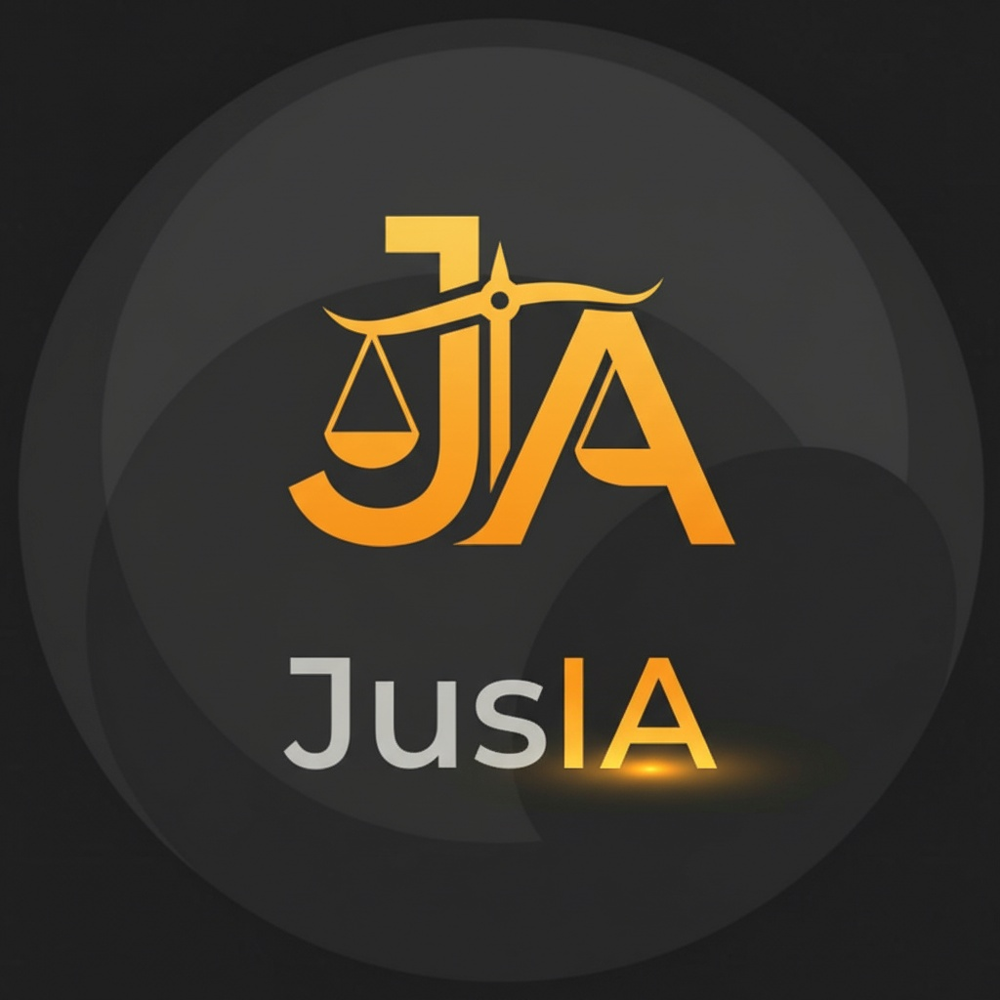

<div align="center">

<h1 align="center">
    JusIA
</h1>

### _Assistente Jurídico Inteligente com IA Generativa_

<div align="center">
  
</div>

<br>

[](https://www.python.org/)
[](https://flask.palletsprojects.com/)
[](https://aws.amazon.com/bedrock/)
[](https://aws.amazon.com/s3/)
[](https://aws.amazon.com/ec2/)
[](https://python.langchain.com/)
[](https://www.trychroma.com/)
[](https://www.docker.com/)

</div>

## 📋 Visão Geral

**JusIA** é um chatbot jurídico desenvolvido como avaliação das Sprints 7 e 8 do Programa Compass UOL - AI com AWS (Maio/2025). Utiliza arquitetura RAG (Retrieval Augmented Generation) para consultas sobre direito brasileiro via Telegram.

**Stack Principal:** Python 3.12, Flask, LangChain, ChromaDB, AWS Bedrock (Titan), S3, EC2, API Gateway, CloudWatch, Docker

> 💬 **Acesso ao Bot:** [@jus_ia_bot](https://t.me/jus_ia_bot) - Envie suas dúvidas jurídicas em linguagem natural

## ⚙️ Pré-requisitos

- Conta AWS (EC2, S3, Bedrock, API Gateway, CloudWatch, IAM)
- Python 3.12+
- Docker e Docker Compose
- Token do Telegram Bot ([@BotFather](https://t.me/botfather))
- Node.js/npm (opcional, para desenvolvimento local)

**Dependências principais:** Flask 3.1.2, LangChain 0.3.27, ChromaDB 1.0.20, Boto3 1.40.17

## 🏗️ Arquitetura


**Fluxo de Processamento:**

1. **Telegram Webhook** → API Gateway → Flask Server (EC2)
2. **RAG Pipeline:** Parsing → Busca Vetorial (ChromaDB) → Recuperação → Sumarização (Bedrock) → Geração de Resposta
3. **Storage:** S3 (PDFs) + ChromaDB local (embeddings)
4. **Observability:** CloudWatch (logs JSON estruturados)

**Top-K:** 3 documentos

## 🚀 Quick Start

### Local

```bash
git clone <repo-url> && cd JusIA
cp .env.example .env  # Configurar credenciais AWS e BOT_TOKEN
pip install -r requirements.txt
python app.py
```

**Exemplo `.env`:**

```env
# AWS Credentials (obtenha do AWS Academy)
AWS_ACCESS_KEY_ID=your_access_key_here
AWS_SECRET_ACCESS_KEY=your_secret_key_here
AWS_SESSION_TOKEN=your_session_token_here
AWS_REGION=us-east-1

# Telegram Bot Configuration
BOT_TOKEN=your_telegram_bot_token_here

# AWS Resources
BUCKET_NAME=your_s3_bucket_name_here

# CloudWatch Configuration
LOG_GROUP_NAME=your_log_group_for_chatbot_server
```

### Docker

```bash
docker compose up -d
docker compose logs -f
```

**Para persistência de dados (produção):**

```yaml
services:
  chatbot-server:
    build: .
    image: desafio4-squad2:latest
    ports:
      - "5000:5000"
    env_file:
      - .env
    volumes:
      - ./chroma_index:/app/chroma_index
      - ./vetorizados.json:/app/vetorizados.json
    restart: unless-stopped
```

### Webhook Telegram

```bash
# Produção (API Gateway)
curl -X POST "https://api.telegram.org/bot<TOKEN>/setWebhook?url=https://<API_GATEWAY_URL>/webhook"

# Dev (localtunnel)
lt --port 5000 --subdomain <nome>
curl -X POST "https://api.telegram.org/bot<TOKEN>/setWebhook?url=https://<nome>.loca.lt/webhook"
```

## 📂 Estrutura

```text
├── app.py                    # Entry point Flask
├── services/
│   ├── bot_services.py       # RAG pipeline
│   └── utils/cloudwatch_logger.py
├── chroma_index/             # Vector DB (auto-gerado)
├── dataset/juridicos.zip     # PDFs jurídicos
├── docker-compose.yaml
└── requirements.txt
```

## ☁️ Deploy AWS

### IAM Policy (ec2-iam-policy.json)

```json
{
  "Version": "2012-10-17",
  "Statement": [
    {
      "Sid": "BedrockModelAccess",
      "Effect": "Allow",
      "Action": [
        "bedrock:InvokeModel",
        "bedrock:InvokeModelWithResponseStream"
      ],
      "Resource": [
        "arn:aws:bedrock:${AWS_REGION}::foundation-model/amazon.titan-embed-text-v2:*",
        "arn:aws:bedrock:${AWS_REGION}::foundation-model/amazon.titan-text-premier-v1:*"
      ]
    },
    {
      "Sid": "S3BucketAccess",
      "Effect": "Allow",
      "Action": ["s3:GetObject", "s3:ListBucket", "s3:GetBucketLocation"],
      "Resource": [
        "arn:aws:s3:::${BUCKET_NAME}",
        "arn:aws:s3:::${BUCKET_NAME}/*"
      ]
    },
    {
      "Sid": "CloudWatchLogsAccess",
      "Effect": "Allow",
      "Action": [
        "logs:CreateLogGroup",
        "logs:CreateLogStream",
        "logs:PutLogEvents",
        "logs:DescribeLogGroups",
        "logs:DescribeLogStreams"
      ],
      "Resource": "*"
    },
    {
      "Sid": "EC2DescribeAccess",
      "Effect": "Allow",
      "Action": ["ec2:DescribeInstances", "ec2:DescribeInstanceStatus"],
      "Resource": "*"
    }
  ]
}
```

### EC2 Setup

```bash
# Instalar Docker
sudo yum install -y docker && sudo service docker start
sudo usermod -a -G docker ec2-user

# Deploy
git clone <repo> && cd JusIA
nano .env  # Configurar variáveis
docker compose up -d
```

**Security Group:** Porta 5000 apenas do IP do API Gateway, porta 22 do seu IP

### API Gateway

Criar REST API → Recurso `/webhook` (POST) → Integração HTTP `http://<EC2_IP>:5000/webhook` → Deploy stage `prod`

## ⚙️ Características Técnicas

- **Performance:** Latência 10-14s, cache de embeddings, top-k=3
- **Segurança:** IAM roles, variáveis de ambiente, TLS 1.2+, logs sem dados sensíveis
- **Observabilidade:** Logs JSON categorizados (CloudWatch), correlation ID, métricas de performance
- **Escalabilidade:** Docker, API Gateway throttling, restart automático

## 💡 Desafios e Aprendizados

**Principais Desafios:**

1. **Integração Bedrock + LangChain:** Conflitos de versionamento e configuração de credenciais temporárias AWS Academy
2. **Webhook SSL:** Necessidade de HTTPS para Telegram (solução: localtunnel para desenvolvimento)
3. **Logging Estruturado:** Implementação de logs categorizados com CloudWatch e correlation IDs
4. **Gestão de Credenciais:** Renovação periódica de tokens AWS Academy

**Lições Aprendidas:**

- Documentação economiza tempo em troubleshooting
- Testes incrementais reduzem debugging
- Observabilidade desde o início facilita identificação de gargalos
- RAG pipeline requer tuning de parâmetros (chunk size, top-k, prompt)
- IAM roles > credenciais estáticas
- Docker garante consistência dev/prod

---

## Troubleshooting

### Bot não responde

```bash
# 1. Verificar se o webhook está configurado
curl "https://api.telegram.org/bot<BOT_TOKEN>/getWebhookInfo"

# 2. Verificar logs do container
docker compose logs -f

# 3. Testar endpoint local
curl http://localhost:5000/

# 4. Verificar se a porta está aberta
netstat -tuln | grep 5000
```

### Erro de credenciais AWS

- Verificar se as credenciais estão corretas no `.env`
- Se usar AWS Academy, renovar credenciais quando expirarem
- Verificar se a role IAM da EC2 tem as permissões necessárias

### Erro ao vetorizar PDFs

```bash
# Verificar se o bucket existe e tem PDFs
aws s3 ls s3://<BUCKET_NAME>/

# Deletar índice e recriar
rm -rf chroma_index vetorizados.json
# Reiniciar aplicação
docker compose restart
```

### CloudWatch não recebe logs

- Verificar permissões IAM para CloudWatch Logs
- Confirmar que `LOG_GROUP_NAME` está definido no `.env`
- Verificar se o log group existe no CloudWatch Console

### Localtunnel não funciona

```bash
# Usar porta diferente se 5000 estiver ocupada
lt --port 5000

# Ou usar alternativa como ngrok
ngrok http 5000
```

### Performance lenta

- Reduzir o parâmetro `k` em `search_kwargs` (atualmente 3)
- Usar instância EC2 maior (t2.small ou t2.medium)
- Implementar cache de respostas frequentes

### Webhook retorna erro 404

- Verificar se o API Gateway está corretamente configurado
- Confirmar que a integração HTTP aponta para `http://<EC2_IP>:5000/webhook`
- Testar diretamente: `curl -X POST http://<EC2_IP>:5000/webhook -d '{"test":"data"}'`

### Docker não inicia

```bash
# Verificar erros específicos
docker compose logs

# Reconstruir imagem
docker compose down
docker compose build --no-cache
docker compose up -d
```

---

## 👥 Equipe de Desenvolvimento

<div align="center">

| Desenvolvedor             | GitHub                                                                                                                    |
| ------------------------- | ------------------------------------------------------------------------------------------------------------------------- |
| Alison da Costa Silva     | [](https://github.com/alisuco)        |
| Caio Henrique Lopes Sousa | [](https://github.com/cls2311)        |
| Filipe da Silva Rodrigues | [](https://github.com/filipe-rds) |
| Stefhany Nunes Adiers     | [](https://github.com/SNunesA)        |

</div>

---

<div align="center">

**JusIA** - _Assistente Jurídico Inteligente com IA Generativa_ 🤖

Desenvolvido com ❤️ pela equipe do Programa de Bolsas Compass UOL

</div>
